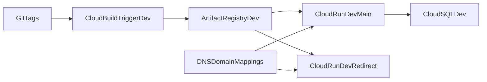

# HidroSync Phase-1 GCP Infrastructure Plan

## Scope And Goals
- Create a **new** Terraform infrastructure baseline for HidroSync (not a copy of the reference) for **dev only**.
- Keep proven strengths from the reference: serverless deployment model, private Cloud SQL path, explicit service/resource grouping, and reproducible infra-as-code.
- Deliver only phase-1 services now: `hidrosync-service` and `redirect-service`.
- Optimize for fast MVP delivery while preserving a clean upgrade path to stricter security.

## Live GCP Discovery Snapshot (gcloud)
- Active project and target project both resolve to `hidrosync` (project name `HidroSync`, project number available).
- `gcloud storage buckets list` returned zero buckets.
- Listing Cloud Run, Artifact Registry, Cloud SQL, Cloud Build triggers, and Cloud Run domain mappings prompted to enable their APIs first, indicating those services are not yet enabled in project `hidrosync`.
- Implication: there is no conflicting production naming baseline to preserve yet; we can define a clean HidroSync-first naming standard from bootstrap.

## Strengths To Keep From Reference
- **Consistent deployable units**: Cloud Run service name, Artifact Registry repo, and Cloud Build trigger share aligned naming.
- **Private Cloud SQL connectivity**: Cloud SQL over private networking and Cloud Run connector path (no direct DB exposure).
- **Operational durability defaults**: backups, PITR, deletion protection for Cloud SQL.
- **Service modularity**: independent deploy lifecycle per service, enabling gradual expansion (scraping/worker later).
- **Domain-first runtime**: explicit domain mapping for app and redirect service.

## Weaknesses To Fix, Plus Drawbacks Of Fixing
- **Over-broad IAM in reference** -> use narrower role sets per runtime service account.
  - Drawback: more setup effort; initial deploy troubleshooting can take longer when permissions are too tight.
- **Region/name inconsistency** -> enforce one region (`us-east4`) and one naming convention (`hidrosync-<component>-<kind>`).
  - Drawback: renaming/migrations from ad-hoc names later may require downtime windows or DNS coordination.
- **Secrets in plain env/substitutions** -> keep this temporary MVP compromise and defer Secret Manager adoption to phase 2.
  - Drawback: higher exposure risk if env values leak in logs/pipelines, and later migration requires coordinated variable rewiring and credential rotation.
- **Legacy permissive network/firewall patterns** -> avoid creating unused broad firewall rules.
  - Drawback: if future VM-based tooling appears, you must explicitly model access rather than relying on permissive defaults.
- **Cloud SQL hardening deferred (MVP choice)** -> keep secure baseline but not full strict posture now.
  - Drawback: temporary security debt; requires scheduled phase-2 hardening and credential rotation.

## Target Architecture (Phase 1)

## Terraform Structure To Implement
- Root infra folder (new): `[infra/terraform](c:/Users/dirce/OneDrive/CodingProjects/HidroSync/infra/terraform)`.
- Environment stack:
  - `[infra/terraform/envs/dev](c:/Users/dirce/OneDrive/CodingProjects/HidroSync/infra/terraform/envs/dev)`
- Reusable modules:
  - `[infra/terraform/modules/project_services](c:/Users/dirce/OneDrive/CodingProjects/HidroSync/infra/terraform/modules/project_services)`
  - `[infra/terraform/modules/artifact_registry](c:/Users/dirce/OneDrive/CodingProjects/HidroSync/infra/terraform/modules/artifact_registry)`
  - `[infra/terraform/modules/network_sql](c:/Users/dirce/OneDrive/CodingProjects/HidroSync/infra/terraform/modules/network_sql)`
  - `[infra/terraform/modules/cloud_run_service](c:/Users/dirce/OneDrive/CodingProjects/HidroSync/infra/terraform/modules/cloud_run_service)`
  - `[infra/terraform/modules/cloud_build_triggers](c:/Users/dirce/OneDrive/CodingProjects/HidroSync/infra/terraform/modules/cloud_build_triggers)`
  - `[infra/terraform/modules/domain_mapping](c:/Users/dirce/OneDrive/CodingProjects/HidroSync/infra/terraform/modules/domain_mapping)
`

## Naming Convention (Adapted To Current GCP State)
- Prefix all resources with `hidrosync`.
- Use `<product>-<service>-<kind>-<env>` for uniqueness and readability.
- Phase-1 concrete names:
  - Cloud Run: `hidrosync-service-dev`, `redirect-service-dev`
  - Artifact Registry repos: `hidrosync-service`, `redirect-service`
  - Cloud SQL instance: `hidrosync-sql-dev`
  - Cloud SQL DBs (single instance multi-db): `hidrosync_service`, `redirect_service`
  - Service accounts: `hidrosync-service-runtime-dev`, `redirect-service-runtime-dev`, `hidrosync-cloudbuild-deployer-dev`

## Implementation Steps
1. Define global naming/label convention and shared variables (`project_id`, `project_number`, `region`, `domain`, `env`).
2. Bootstrap APIs first (`run`, `artifactregistry`, `cloudbuild`, `sqladmin`, `servicenetworking`, `secretmanager` optional/deferred, and dependencies) and verify they are enabled before creating dependent resources.
3. Provision Artifact Registry repos for `hidrosync-service` and `redirect-service`.
4. Provision VPC + private service access + one Cloud SQL PostgreSQL instance for dev.
5. Create separate Cloud SQL databases per service in that instance (per your selection).
6. Provision Cloud Run services (`hidrosync-service` + `redirect-service`) with env-specific scaling/resources and Cloud SQL mounts only where needed.
7. Configure domain mappings for public endpoints (app and redirect).
8. Create dev-only tag-based Cloud Build triggers for both services.
9. Keep local Terraform state for bootstrap (your choice), but prepare migration note to GCS backend before team scaling.
10. Add `README` in infra folder with apply order, variables, and phase-2 hardening backlog.

## Two-Phase Apply Strategy (Dev)
- **Phase A: bootstrap**
  - Owns: provider setup, required API enablement, baseline IAM for Terraform execution, and optional local-state conventions.
  - Output: APIs are active and dependencies are ready for service provisioning.
  - Apply target: `infra/terraform/envs/dev-bootstrap` (or `dev` with bootstrap-only module selection).
- **Phase B: runtime**
  - Owns: Artifact Registry, VPC/private service access, Cloud SQL instance + databases, Cloud Run services, domain mappings, and Cloud Build triggers.
  - Depends on: successful completion of Phase A and API propagation.
  - Apply target: `infra/terraform/envs/dev`.
- **Execution order**
  - Run `terraform init/plan/apply` for Phase A.
  - Wait for API propagation (a few minutes if needed), then run `terraform init/plan/apply` for Phase B.
  - Re-run Phase B apply once after first deploy to reconcile any eventual-consistency IAM/API delays.

## Tag/Release Strategy (Cloud Build)
- Keep tag deploy model from reference, but with HidroSync naming:
  - `hidrosync-service-dev-vX.Y.Z`
  - `redirect-service-dev-vX.Y.Z`
- Each trigger points to the service-specific `cloudbuild.yaml` and receives env substitutions.

## Phase-2 Backlog (After Dev Stabilizes)
- Add a separate prod environment stack with isolated runtime/service accounts and Cloud SQL instance.
- Replace any temporary broad IAM grants with minimum required resource-level grants.
- Move all remaining sensitive vars to Secret Manager and rotate credentials.
- Migrate Terraform state from local to GCS backend with lifecycle protections.
- Add policy checks (e.g., validate no accidental public DB, no wildcard IAM) in CI.
- Optional: evaluate region move to `southamerica-east1` once latency/cost data is collected.

## Success Criteria
- `terraform plan/apply` succeeds for the dev stack.
- Both Cloud Run services are reachable via intended domains.
- Main app connects successfully to Cloud SQL over private path.
- Deployments happen through tag-based Cloud Build triggers.
- Infra docs clearly identify MVP compromises and exact hardening follow-ups.
